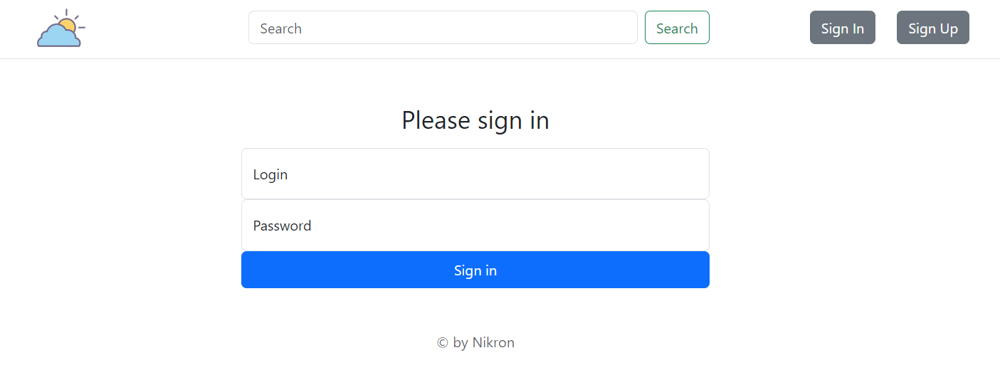
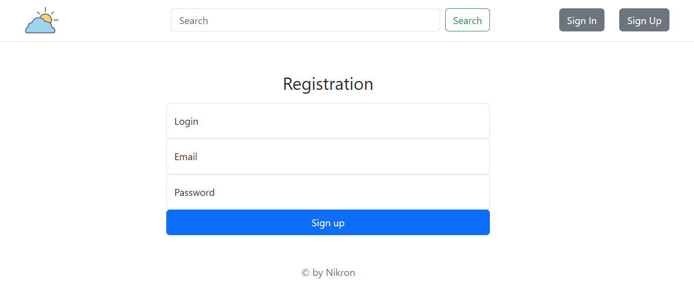
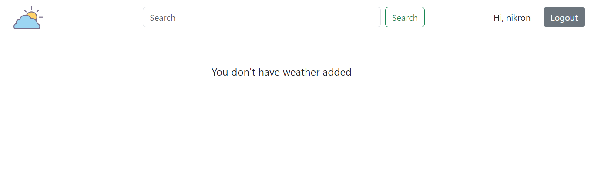
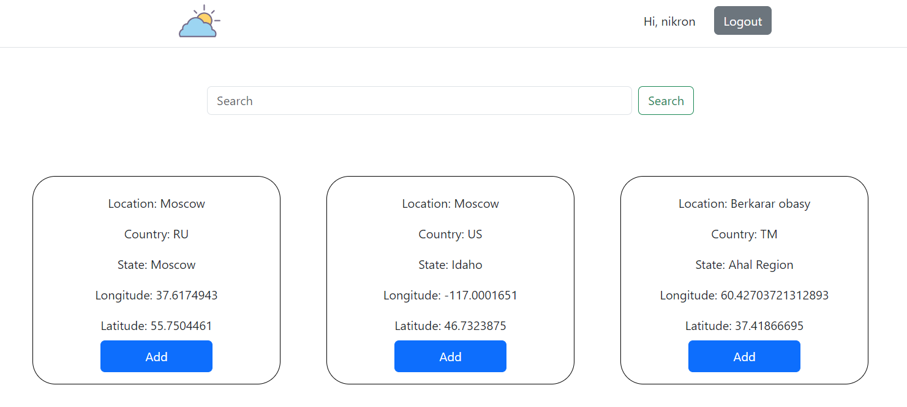
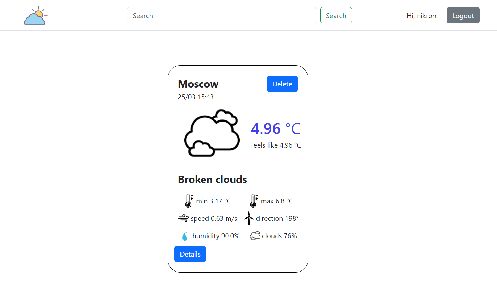

# Веб-приложение для просмотра текущей погоды.
## Пользователь может зарегистрироваться и добавить в коллекцию один или несколько локаций (городов, сёл, других пунктов), после чего главная страница приложения начинает отображать список локаций с их текущей погодой.
### Функционал приложения
#### Работа с пользователями:

* Регистрация
* Авторизация
* Logout

#### Работа с локациями:

* Поиск
* Добавление в список
* Просмотр списка локаций, для каждой локации отображается название и температура
* Удаление из списка

## Технологии
* Java
* HTML/CSS
* Bootstrap
* Thymeleaf
* Maven
* JUnit 5
* Tomcat
* Hibernate
* PostgreSQL
* FlyWay

## Внешний вид

## Запуск с помощью Docker Compose
Для запуска проекта с помощью docker compose необходимо определить переменные окружения в файле Docker-compose.yml

После этого выполнить команду:

    docker-compose up -d